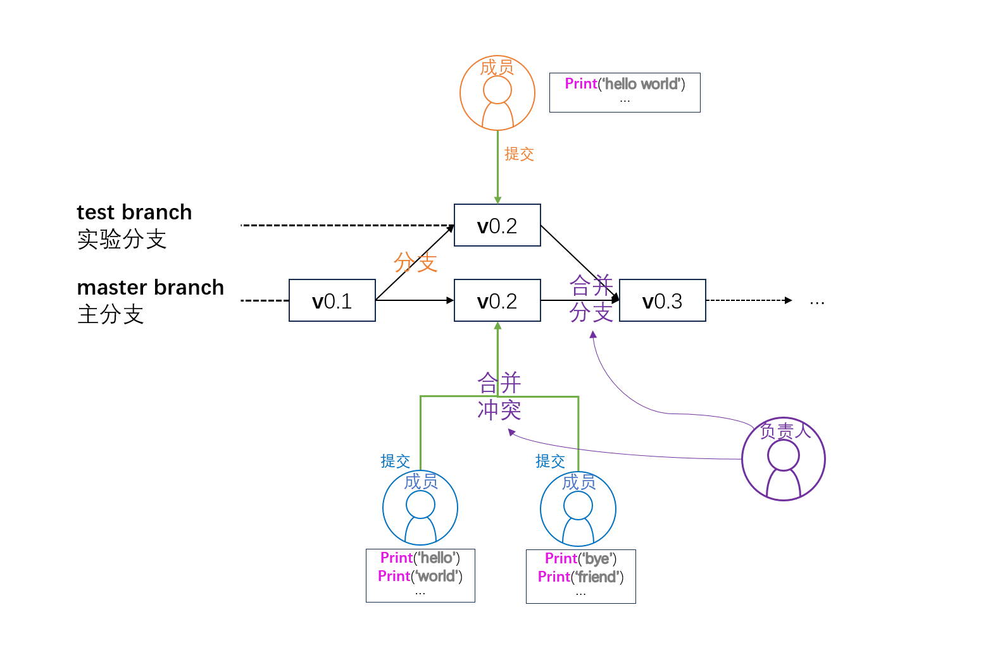

# Git and Hub

也许最初人们分享项目代码，是靠软盘磁带，后来靠传文件。如果你不想电脑里的压缩包满天飞，每小改一下就传给同事一个压缩包，那么乘早使用**Git**和**GitHub**比较好。  

Git 和 GitHub 的关系，就像：
- 单机游戏之于对战平台
- 本地文件之于云盘
- 快递站之于物流系统

> 我们一般认为，现代人都有网络，都能用上如**GitHub**这类的远程仓库。因此暂不讨论单机玩**Git**的情况

下面是当你加入一个团队后，他们的**Repo**（仓库，装项目代码的地方）可能出现的情况：


## Git
Git 是一个开源的分布式版本控制系统，用于**保存代码历史**，方便**多人协作**的工具。  

大量时间内基本只会用到几个命令，以下是概念介绍：  
- **conflict** 冲突：两个人同时改了一段代码，Git 不知道用谁的，这叫“冲突”。可以通过商量或用工具解决。
- **branch** 分支：相当于复制一条**单独的开发路线**，你可以在自己的路线上随意修改，不影响主线。
- **merge** 合并：把你的分支改动合并到主项目，就像**把两条路重新连在一起**。
- **clone** 克隆：把别人的 repo **拷贝**到自己电脑上。
- **pull** 拉：从远程 repo 获取最新的代码更新，就像**下载最新版本**。
- **push** 推：把你修改过的代码**上传**到远程 repo，别人也能看到。
- **commit** 提交：保存代码修改，类似于**按保存键**，并给每次修改加一个**文字说明**。

想要创建一个**Git**仓库，也就是**Repo**，可以用命令：
```shell
git init {your_path}
```

> 在 commit 时不给文字说明，是不让提交的。如果你被卡 commit 了，记得看一眼 comment（评论）里有没有写文字说明。

因此，聪明的你发现了：如果只是自己用 git，当作备份保存的管理工具，其实只会用到`clone`、`commit`、`push`、`pull`功能。

**说一千道一万，为什么不去自己开个 GitHub 账号，把上面十来行东西试试呢？你这辈子总得试一次才能会吧。一次会，次次就会。**

### GitIgnore
有些时候，你不想把某些文件或文件夹提交到 Git 仓库，比如：
- 临时文件：这些非正式文件很可能写的稀烂，或是机器生成的废料
- 编译生成的可执行文件：又丑又大
- 数据库文件：巨大好吧
- 敏感信息：给人看你的服务器账号密码吗？

因此你可以在项目根目录下创建一个 `.gitignore` 文件，列出这些文件或文件夹，Git 就会自动忽略它们。  
**.gitignore** 异常简单的规则:  
```yml
# 忽略所有.a 文件
*.a
# 但不忽略 lib.a
!lib.a
# 忽略所有 build/ 目录下文件
build/
# 忽略 doc/notes.txt
doc/notes.txt
```
值得注意的是，你得在项目初始化时就写好 gitignore。
在项目中途添加 `.gitignore` 文件时，Git 会按照这个新添加的规则开始忽略指定的文件，但已经被 Git 追踪的文件不会自动被忽略。这是因为 `.gitignore` 只对**未被追踪的文件**生效。

1. **已被追踪的文件**：如果这些文件已经在之前被 Git 追踪，即使你在 `.gitignore` 中添加了它们，Git 仍然会继续追踪它们。换句话说，之前提交的文件不会自动消失，需要手动停止追踪。
2. **未被追踪的文件**：从 `.gitignore` 添加后，未被 Git 追踪的文件会根据规则被忽略，Git 不会再提示它们的状态变化。

- 如果希望停止追踪某个文件，可以使用命令：
  ```bash
  git rm --cached <file>
  ```
  这会让 Git 停止追踪该文件，但文件本身仍然存在于项目目录中。  
  **或者干脆把仓库注销了，重新带上 gitignore 初始化仓库。**

## GitHub

加入全球代码玩家的最大服务器，在上面炫耀你的项目，证明你的能力。GitHub 目前已被 Microsoft 收购，但它仍然是全球最大的开源代码仓库。

GitHub 上的 repo 分两种：`public`和`private`。public 所有人可见，大多持有不同版本的开源许可证；private 只有作者和授权者可见。

除了个人项目，GitHub 上你可以创建组织（Organization），共同持有一些 repo 资产。

人们常在 GitHub 使用这些功能：
- **Profile**：用户的个人页，装修好你的 GitHub 主页并狠狠炫耀
- **Group**：组织的主页，和 Profile 同理。许多公司也会把项目放在这里，并把能公开的设为 `public`
- **Repository**：repo （仓库）主页，通过写好 README 来狠狠炫耀你的项目，GitHub 会在 repo 主页自动渲染 README 内容
- **Search**：通过关键字搜索别人的项目并狠狠视奸它们😭
- **Star**：点亮 repo 的小星星，类似收藏。代表着开心，代表着快乐
- **Fork**：Fork 别人的仓库，基于该版本继续开发。能 Fork 的基本都是带上开源许可证的，不太担心被碰瓷（前提是你也别侵犯别人的自由）
- **Issue**：本来是对可见用户设计的提问留言板（帖子），用于报 bug、优化意见、设计意见等等……现在在低龄化趋势下，有进一步成为厕所的嫌疑……当然也有的团队将此作为周汇报、工作沟通的手段（而不是在聊天群里混乱的塞满信息）
- **Actions**： GitHub Actions 是 GitHub 推出的 CI/CD 工具，可以在**云端**自动化地执行各种任务，比如编译、测试、部署等等
- **Pages**：GitHub Pages 是 GitHub 推出的静态网站托管服务，你可以用它快速搭建个人博客、项目文档、个人作品展示等等……许多项目的官网都因成本低屁事多而挂在 GitHub Pages 上

看完这些，你可以去玩 GitHub 试试看了。

## GitHubDesktop & VsCode

GitHubDesktop 是 GitHub 官方推出的跨平台 Git 客户端，功能丰富，界面简洁。VsCode 内置了 Git 插件，让**管理项目**和**编写项目**融为一体，操作更丝滑。

**一般而言，开发者主要使用以上两种工具，来避免繁琐的 Git 命令操作。这两样就够大部分人挑了。**

## Git Ifs