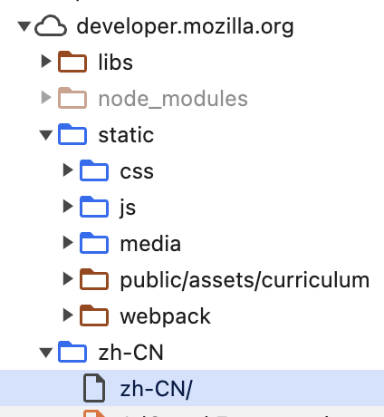

# HTML, CSS, and JavaScript

## 在哪儿学
MDN：https://developer.mozilla.org/zh-CN/docs/Learn/Getting_started_with_the_web

## 三件套是什么

### HTML

HTML 是一种标记语言，即没有编程能力，只能描述内容的结构。HTML 由一系列标签组成，每个标签代表一个元素，元素之间可以嵌套。HTML 用于描述网页的结构，包括标题、段落、列表、表格、图片、链接等。是网页的骨架，决定了网页逻辑上的结构。

### CSS

CSS 是一种样式表，用于描述网页的外观，包括 HTML 元素的位置、间隔、大小、装饰和交互等等，是网页的皮肤，决定了网页视觉上的表现。CSS 通过选择器选中元素，然后为这些元素设置样式。

### JS

JS 是一种用途广泛的脚本语言，在网页开发中，主要用于实现网页的交互功能，比如界面的动态效果、用户的交互行为、数据的获取与处理等等，网页大部分的交互、功能都通过 js 实现。是网页的肌肉，决定了网页的功能。

## 常规业务如何实现

一些古早的，没有前端框架时的网页开发，基本有如下几个步骤：

1. 编写 HTML 结构，描述网页的内容
2. 编写 CSS 样式，描述网页的外观
3. 编写 JS 脚本，实现网页的交互功能

假如要实现一个点击按钮，弹出一个提示框的功能，可以按照如下步骤实现：

```html
<!DOCTYPE html>
<html>
  <head>
    <title>点击按钮弹出提示框</title>
  </head>
  <body>
    <button id="btn" class="alert-button">点击我</button>
  </body>
</html>
```

再根据上面写的 HTML，用 CSS 来美化外观。

每一段 CSS 中，第一行是选择器，用于选中元素，后面的花括号里面是样式，被选中的元素会应用这些样式。

```css
button.alert-button {
  background-color: #f44336;
}

button#btn {
  background-color: #4caf50;
  color: white;
  padding: 14px 20px;
  border: none;
  cursor: pointer;
}
```

再使用 JS 来实现交互功能。

```js
// 先选中按钮元素
const btn = document.getElementById('btn');
// 给按钮添加点击事件
btn.addEventListener('click', () => {
  alert('Hello, world!');
});
```

就实现了一个点击按钮，弹出提示框的功能。

JS 是一门通用编程语言，但是在网页开发中，浏览器提供了非常多数量的 API 用于操作网页，在网页开发中大概分为两类：

1. DOM 操作：操作网页的元素，比如选中元素、添加元素、删除元素、修改元素的属性等等
2. BOM 操作：操作浏览器的功能，比如获取浏览器的信息、获取用户的位置、发送请求等等

### DOM 操作

DOM 是 Document Object Model 的缩写，即文档对象模型，是浏览器提供的一种 API，用于操作网页的元素。

要做的操作无非就是对元素增删改查，以及插入、移动、复制等等。

```js
// 创建、修改并插入到页面上。
const btn = document.createElement('button');
btn.id = 'btn';
btn.className = 'alert-button';
btn.innerText = '点击我';
btn.addEventListener('click', () => {
  alert('Hello, world!');
});
document.body.appendChild(btn);

// 对已经存在的元素进行操作
const btn = document.getElementById('btn');
btn.style.backgroundColor = '#4caf50';
```

### BOM 操作

大部分浏览器提供的，跟操作元素无关的功能，基本可以归为 BOM 操作，比如发起网络请求、获取用户位置、操作 cookie 等等。

```js
// 发起一个 GET 请求
fetch('https://api.github.com/users/').then(res => res.json()).then(console.log);
// 获取用户的位置
navigator.geolocation.getCurrentPosition();
// 操作 cookie
document.cookie = 'name=hello';
```

这个建议用到的时候直接搜索，比如搜索 `fetch`，`navigator.geolocation`，`document.cookie` 等等。

## 浏览器

### 什么是浏览器

浏览器的本质是一个下载 HTML 并解析渲染的工具。

当在浏览器打开一个网址的时候，服务端一般会返回一个 HTML 作为，HTML 里面有 CSS 和 JS 的引用，以及图片、视频的地址等，浏览器会并行地下载并缓存，就像这样：



浏览器拿到这些资源之后，就依据这些资源来渲染网页，渲染的过程大概分为如下几个步骤：

1. 用 HTML 构建 DOM 树
2. 读取 CSS 和 HTML 中编码的样式信息，构建样式树
3. 将 DOM 树和样式树合并成一个渲染树
4. 根据渲染树来布局，计算每个节点的位置
5. 绘制每个节点
6. 把结果显示在屏幕上，并接受用户的交互

同时 JS 代码一般会在上面的过程结束后再执行，当 JS 代码修改了 DOM 树或是样式的时候，浏览器会重新执行上述步骤，重新渲染页面。

### 常见浏览器

- Chrome：Google 出品的浏览器，目前使用最广泛的浏览器
- Firefox：Mozilla 出品的浏览器，开源
- Safari：苹果出品的浏览器，macOS 和 iOS 上是默认浏览器

其中 Chrome 有开源版 Chromium，而市场上有大量基于 Chromium 衍生的浏览器，比如 Edge、Opera 以及国内的 360、2345、QQ 浏览器等等。Chrome 与 Chromium 及其衍生占了整个市场的 90% 以上。
