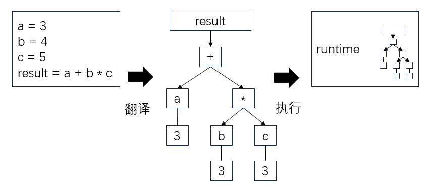

# 编程语言
> 提示：本文档**不针对任何特定语言**，主要描述对象为接近 oop 的语言（类似 Js、Python、Java、C#、Cpp 等）。  
> 如果你指望在这里学到某门语言的具体用法，那就大错特错了。  

本文档有一个不切实际的希望：看完之后，每当你面对一门新语言，你都应当能猜出大多语言的设计——没错，举一反三的要诀是**猜**而不是**查**或**背**，100 个问题中，有 90 个都得猜出来，否则会累死人。  

国内编程语言的课大多又臭又长，翻来覆去就讲语法。好一些的会带上编译过程、执行过程的解释——但都太冗长。  
要想做到**不被语言拖累**，三天上手新语言的水平，我们需要在学语言之前了解编程语言的大概结构：  

- code 文本代码
- parser 语法分析器
- runtime 运行时环境

在文本框中输入代码，parser 负责将**文本代码**翻译为语法树 AST，最后运行时环境（runtime、进程）负责执行 AST。  
  
> 所以，当我们说编译器报错、运行时报错，你至少得知道是**哪个环节**出了问题。  

我们重点关心语法语义层面 **（代码层）** ，只会少量碰到 parser 和 runtime。  

## 开始写代码
程序的定义是**为执行特定任务，经过数据输入，计算后，输出结果**的过程。  
你写的代码，算程序；广义说，法院的流程，也算程序。

所有语言都能找到输出用的方法（函数）。大部分叫`print`，也有叫`out`，甚至有`consloe.log`，还有更奇怪的。  
总之，拿到一门新语言，请你先去找到它的I/O接口（函数），并稍微关心它是输出到哪儿的（有些甚至输出到浏览器的控制台）。  

## 1·表达式 expression、左右值 l-value r-value、返回值 return value

### 表达式 expression
表达式是由常量、变量、运算符或函数等组成的语句，它能产生一个值，也可以不产生。  

比方如下表达式：`a + b`和`1 + 1`可以产生一个值，结果为它们值的加法运算。而`fun()`则不一定产生值，毕竟这个函数可以返回**空**（或不发生返回行为）。  

### 左右值 l-value r-value
左右的划分是以赋值符号（一般为`=`）为基准来的，顾名思义，左侧是左值，右侧是右值。  
```c
a = 3 + sin(20);
```
> **左值（L-value）** 一般是可修改的变量或对象。在 **（相对）低级语言** 中指向一个实际存储数据的地址。**右值（R-value）** 可以是常量、表达式的结果等，它们只能出现在赋值语句的右边，你可以认为它们是**临时性的**。  

并非所有编程语言都严格区分左右值，但许多低级语言和编译型语言（如C、C++）都有这种设计。在这些语言中，左右值的区分主要源于内存管理和变量赋值的需求。而在一些高级语言（如Python、JavaScript），左右值的概念不是显式的，但依然有其隐含的行为。  

左右值在**低层次内存管理有关的语言中是一种有益的抽象**。
随着**现代编程语言**的**抽象化和高级化**，严格区分左右值的设计在某些语言中可能显得**冗余**，许多高级语言更关注业务逻辑的简洁性，而不是对底层内存的显式控制。  

**让你了解左右值——这个编程语言的设计概念，仅仅是为了利于你在上手一门新语言是来得更容易，不要抓耳挠腮——而不是让你当语言警察四处出警喷群友。**  

### 返回值 return value
现在你应该明白了，表达式能返回值。把某些表达式置于赋值号`=`的右侧，算是一种基操。甚至很多表达式的设计，就是为了让你方便将它当作右值用的（哪怕右值在该语言中是个伪概念）。  

因此下面不再啰嗦所有关于**返回值**相关的讨论。

## 2·条件分支 if

`if` 一般分两种，你能在大部分语言里找到下面两种用法。    

正常 if：
```js
if (contition) {}
else {}
```
三目表达式，简化了 if，用于只返回值的条件分支：  
```js
condition ? value1 : value2 // 如果条件为真，返回 value1，否则返回 value2
```
比方这样：`message = (score > 60) ? '你及格' : '不及格';`

## 3·循环 for 和迭代器

`for` 一般分几种。  

三段式 for：
* 大部分语言
```js
for(i = 0; i < n; i++) {}
```

迭代器 for:
* js
```js
for(one of something) {}
```
* js python swift ... 
```swift
for(one in something) {}
```
* 神秘语言
``` java
for one : something {}
```
* c++11
```cpp
for(auto i : something) {}
```
这些写法太多了，但大致有如下特点：  
- 三段式：**初始化、条件、迭代**，然后循环往复。  
- 迭代器：每次从 something 中取出一个 one，然后循环往复。  

三段式太简单了，我们看下for迭代器的用法。

### 迭代器是什么？  
一般来说，迭代器是 **数据结构（又叫“容器类”、“集合类”）** 自带的东西。它提供了一种访问容器内部元素的方法，而无需暴露该容器的内部结构。迭代器同通常提供下面两种核心方法：  

-` next()`：返回集合中的下一个元素。
- `hasNext()` 或 `isEnd()`：判断是否还有下一个元素可以返回。

> 在算法层面，我们叫它**数据结构**；在语言的文档里，我们叫**容器类**、**集合类**。层次不同，叫法不同。  

**💀💀如果你大致知道，可以跳过了。下面是为新手讲的，非常啰嗦。💀💀**  

你应该见过以下容器：
- 数组、列表 list、array
- 映射 map
- 集合 set

如果没见过，赶紧去搜索引擎见见。  
你会经常用到这些容器类，比方：
```js
myArray = [1, 2, 3];
myMap = {'Math': 98, 'English': 54};
```

这些**用不同方式组织起散的数据**的东西叫容器，之所以他们不散，是因为他们都**被某种东西连接起来了**。  
链接它们的就是**迭代器（iterator）**。  
对于某容器a，你往往能通过`a.begin()`拿到它的首个迭代器，访问它的元素内容和相关信息。然后通过`a.next()`拿到它的下一个元素，直到末尾。  
这个过程叫**迭代（iteration）**。
```js
a = [1, 'two'];
it = a.begin(); print(it.value()); 
// 1
it = it.next(); print(it.value()); 
// 'two'
```
像数组迭的代器顺序，有实际意义，和数组顺序有关。对于许多无序容器，则不必多考虑迭代器顺序意义——**它只是纯粹给你串起来，方便你用 for 遍历的**。  

### 迭代器 for 遍历

这是好文明，得多用。既好看，又易懂，还能吃上语言的各种优化buff（比如运行时优化或编译优化）。  
比如我们把自己的成绩改及格：  
```js
myMap = {'Math': 98, 'English': 54};
for(let score of myMap) {
    if(score.value < 60)
      score.value = 60
}
```

**至此，别再动不动用三段式了。迭代器更多时候符合人类自然语言习惯。还有，你不该再看不懂任何语言关于 for 的代码了——至少得大致猜出它在干什么。**

## 4·函数 function
函数就像**机器**：你给它一些输入，它会吐出结果。比如你知道的 `sin(x)`，输入 `x`，它会返回 `y`，这就是输出。函数名就是机器的名字，`x` 是你给机器的材料（**参数**），`y` 是机器处理后的产品（**返回值**）。

```js
function add(x, y) {
  return x + y; 
}
```

### 匿名函数 anonymous function
匿名函数是**没有名字的机器**，你只用一次，所以不用起名字。这种函数特别灵活，用完即走。

```js
(x, y) => { return x + y } // js
{ (a: Int, b: Int) in a + b } // swift 直接返回单句表达式值，省略 return
```

### Lambda 表达式
Lambda 就是匿名函数的另一种写法，通常更简洁。很多语言里都有这种方便写法，直接拿来用。**注意：它是表达式，不能直接调用，你也许想到了可以将它的值塞在`=`的右边……**  

```js
(x, y) => x += y // js 直接返回单句表达式值，省略 return
[&x](int y) -> int { x += y; } // c++
```

### 闭包 closure
闭包就是**记住环境的函数**。它会把外部的变量“锁”在自己的记忆（context 上下文）里，哪怕这些变量已经不在其他地方存在了，它仍然可以使用它们。

```js
function outer() {
  let name = "小明";
  return function() {
    console.log("你好，" + name);
  };
}
const greeting = outer();
greeting(); // 输出：你好，小明
```

**你用函数的方式更灵活了，之后就不要抱怨看不懂人家的代码了。**

## 5·类 class、对象 object

### 生命周期

大学里教 oop（面向对象）的时候又臭又长，还让背一堆概念。实际上，多数时间我们只聚焦于一件事情：**对象的生命周期**。  

其余的事情，等你需要用到，再去搜都不迟。  

有一类对象（言下之意，除了内容，形式一致）需要被描述。于是需要写它的**类 class**：

```cpp
class MyClass {
  std::string name; // 成员 成员熟悉
  void hello() { printf("Hello I'm %s.\n", name); } // 成员 成员函数 成员方法
  MyClass(str_name): name(str_name) {} // 构造器 构造函数 constructor
  ~MyClass() { printf("I'm dead.\n") } // 析构器 析构函数 destructor
}
```

有了类，你通过它的**构造函数**可以用它生产一大批同类对象 object：  
```cpp
auto Tom = MyClass("Tom");
auto Bob = MyClass("Bob");
```
在这里使用了构造函数，**构造函数是一个对象的生命开端**，负责处理初始化。如果某次 bug 中你很无辜地说：明明我都没动手，这对象自己出了问题——**别忘了去查一下构造器**。  

> 构造函数的设计在不同语言都不一样，例如 python 使用了约定的 `__init__()`， cpp 和 java 使用了**和类同名的函数**，js 使用了 `constructor()`……无论如何，都是为了在对象**初始化**时做些动作的（清零、配置等初始化）。


生命周期的中途，你还会使用它：  
```cpp
Tom.hello();
```
因此，**成员**一般是在生命周期中拿来使用的。无论是**成员方法/函数**还是**成员属性/变量**。

最后 Bob 和 Tom 可以死了，我们得销毁他俩。  
其实一般都不用你手动做，比如：
```cpp
void TomAndBobsLife() {
  auto Tom = MyClass("Tom");
  auto Bob = MyClass("Bob");
  ...
} // 离开该作用域时，Tom 和 Bob 会被 RAII(Resource Acquisition Is Initialization) 自动销毁
int main() {
  TomAndBobsLife();
  return 0;
}
```
好了，接下来的代码它们再也不会活过来了。**析构函数**负责处理销毁，它会在对象被销毁时自动调用。在这里体现为被`TomAndBobsLife()`该函数通过RAII销毁掉`Tom`和`Bob`并回收资源（内存）。

现在大概知道什么是类和对象了吗？你可以参考柏拉图的**理念论**一说，来理解它的希腊哲学来源。

> 木匠在制作床之前，他的脑中都会事先存在**设计图**，这个设计图就是 **“类”**，它定义了床的所有特征和功能。而每一张 **真实的床（实例）** ，每张床都是一个 **“对象”**。

**展示完之后，我们绝不是希望你全流程手动控制对象的生命周期！皇帝也是人，一个皇帝控制每个公民的命运，这个国家吃枣药丸的！！**  
**相反，你应该尽力避免 cpp 的手工控制对象生命周期（资源回收）这类事情（如果你是老手自然就知道要用一定的模式和技巧去管理动态内存）。**

### 坑点

上面之所以用 cpp 举例，是因为 cpp 最繁琐，暴露的细节足够多。  
然而，哪怕像 java 这么老的语言，都不希望你去操作析构函数（内存回收），java 认为 jvm（java 的虚拟机）应该用一定的算法流程（gc garbage collection 垃圾回收）帮你做好这件事——很多 cpp 小宝宝会把代码写炸，乃至炸穿服务器，带来若干严重损失。

> 如果是政治学理论，兴许我们还要讨论一下伦理学；但这里是编程语言的手册，我们只讨论风险和效率。

现代语言都认为，对象的生命周期应当由 runtime 解决，而不是你这个 coder 皇帝亲自动手——就像是地方事务应该交给地方长官，而不是累死罗马皇帝。于是我们看到了以下分层：

- 业务层/任务层：你的代码写在这里，专注于你的业务/任务
- runtime 层：运行时会提供所有**设计者认为的**必要支持（比如垃圾回收、协程控制）

### 隐式转换
// todo

## 6. 同步 & 异步
// todo

## 7. 并发