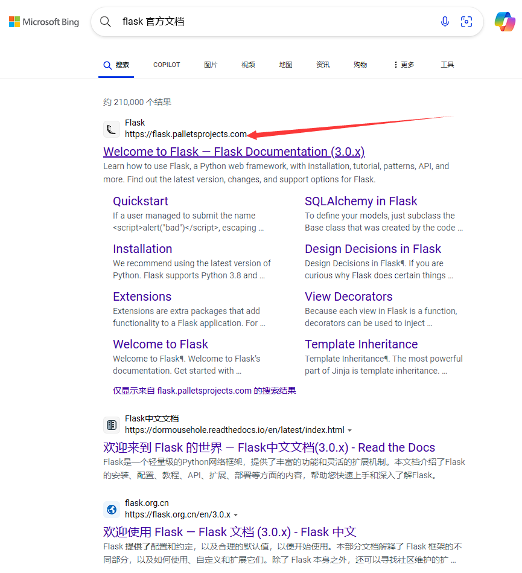
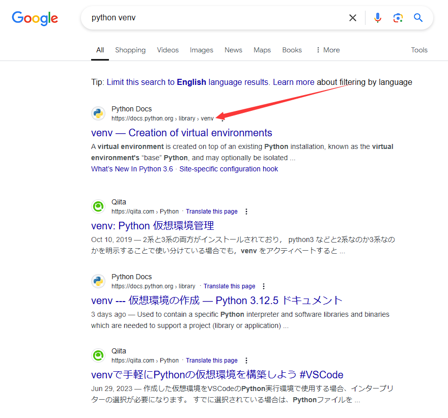
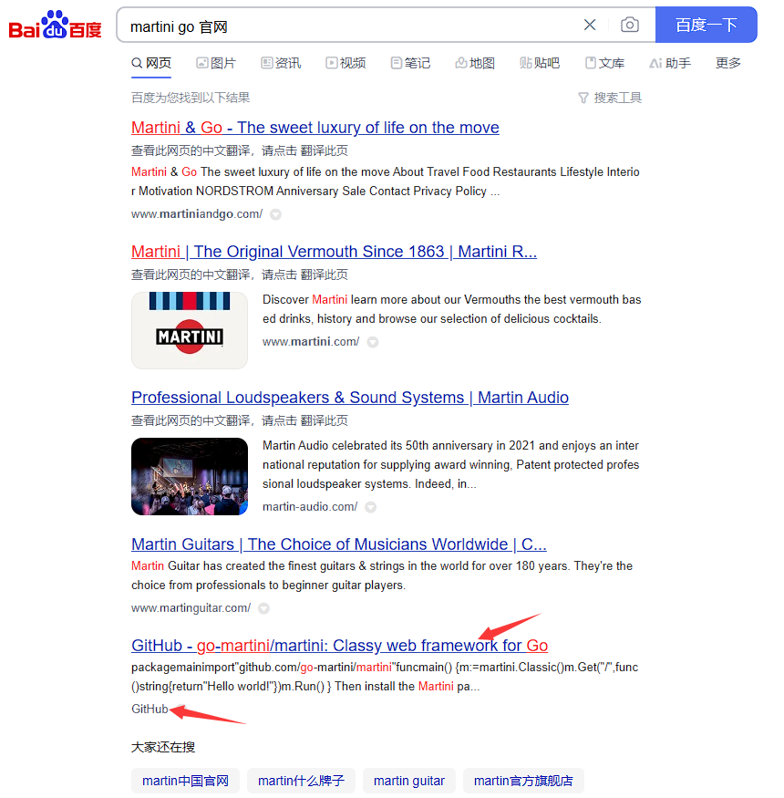
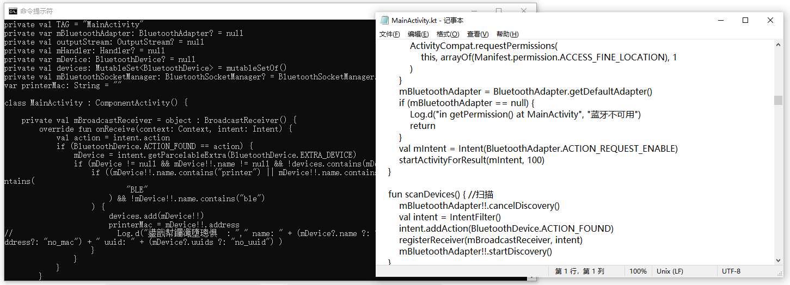
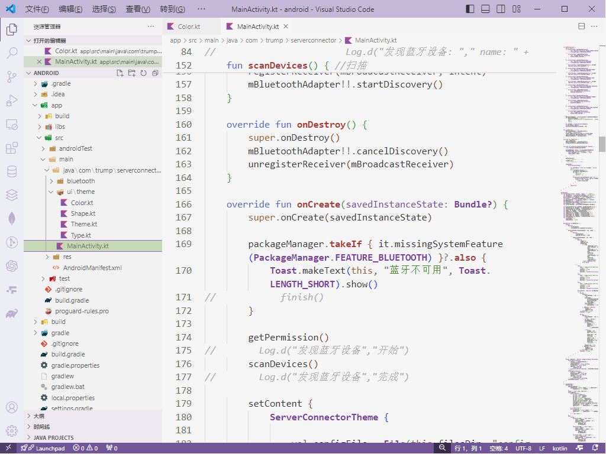
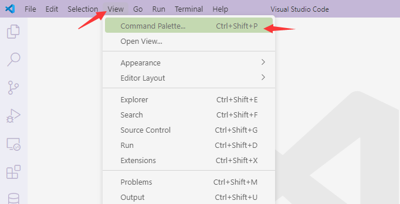
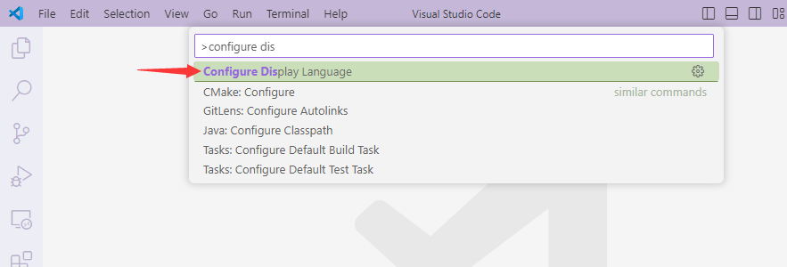
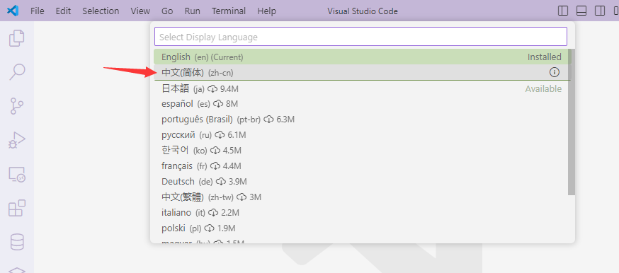
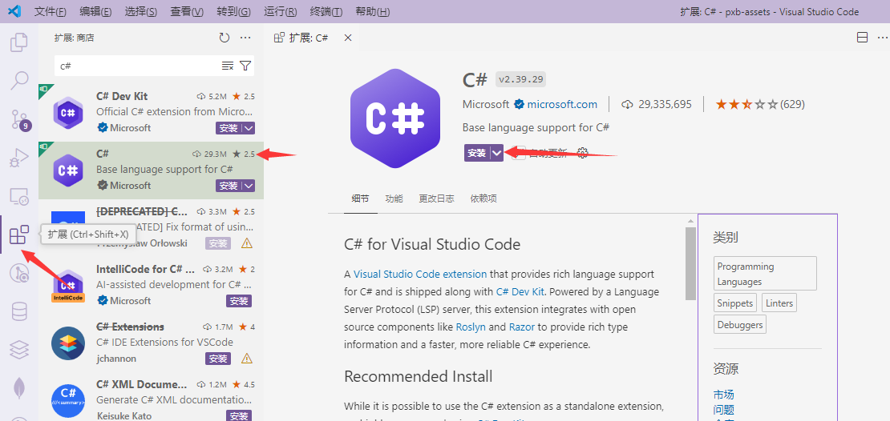
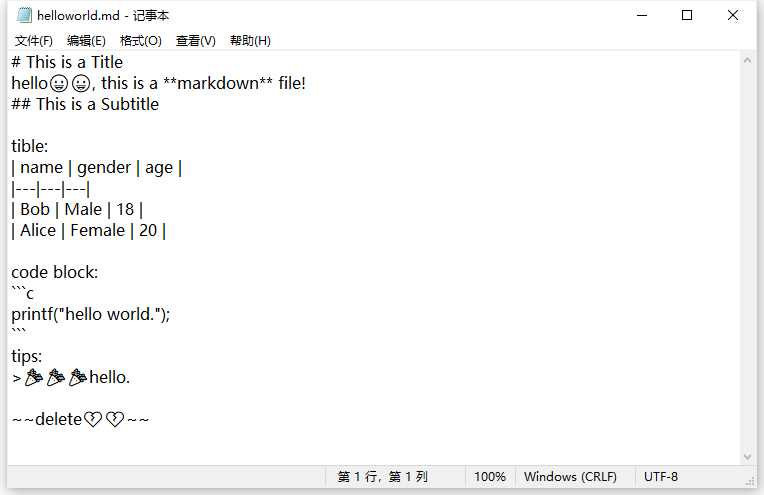

# 课前须知之工具思维
请在任何系列课程前了解本手册内容，确保能够顺利展开课程，以及课后实践。  
>在一个国家的正常教育体系中，**这往往是义务教育实验课的职责**。如果要在正课内加上此内容，正课的课时、讲师的连贯思路将无法负担——离开政府财政的支持，再科学的课程设计都无力负担这项责任（请勿指责讲师和课程研发团队）  
>因此，我们采用了这种方式让你快速了解 **coding** 行业的基础思维。

**你可以选择跳过，但如果你是做题家，请务必阅读该手册！**

---

快速判断自己是否是做题家的方法：  
- 认为理解混乱，可以靠勤能补拙解决
- 认为掌握知识的体现是：倒背如流一切细节，就像朝廷士大夫阶级那样
- 没有认识到**以 cs（计算机科学）为首的学科学生**低水平，本质是整个业界（学术界、工业界）对教育体系贡献的失职。没见识过其它学科完善的教学链条（或学科史对教育的作用）
- 认为所谓的自学方法**是教师不管，放任学生在泥潭挣扎**，或认识不到何谓**学习泥潭**

---

如果你决定要阅读，切记：**不要记忆；而是通读、思考，收获想法**。

## 工具思维
目前大多观点认为**工具思维**是指一种技能，或说**经验、习惯与直觉**，就像解决问题的**肌肉记忆**。  
更高级地对应**工具理性**（Instrumental rationality、有时含贬义），指精确计算功利的方法最有效达至目的的理性。  
只用肌肉记住一种操作，是无法触类旁通的。形成自己的工具思维，目的在于**往后的日子不再从头硬学任何工具**，而是举一反三地快速掌握许多工具。  
>我们主张：人脑应当用于创造性的知识活动，而非苦苦挣扎于工具的限制。比起从头学每一样工具，掌握触类旁通工具的方法可以极大简化记忆——这就是**工具思维**的便利。

## 知识思维
按康德认识论的定义，**知识是由抽象（高级）的概念（观念）组成的网络**。理性负责使用、创造与发展这张网络。理性不仅仅是逻辑推理的能力，它更涉及到我们对概念的理解、以及对世界的超越性认识。  
涉及到我们的课程，你最好将有限的理性资源，用于对知识的吸收、判断和应用上，包括但不限于：
- 我需要什么框架来满足该项目的需求？
- 该框架为我提供了什么编写方式？我要如何编排代码结构？
- 我的项目中，代码是对同事协作友好的吗？可读性、耦合性和扩展性如何？
- 我的项目中，接口和功能是利好使用者（消费者）的吗？

这就是我们推崇工具思维，把个人有限的理性资源投入到更为高级问题的理由。对上述问题的考量**决定了你的水平上限**（而不是对工具的熟练程度）。  

# 授人以渔
接下来将介绍以下工具内容：
- 搜索引擎：信息检索
- 命令行：文法逻辑和两种命令
- 编辑器：高效代码编写
- markdown：一种大面积流行文档

这些需要你通读（而非背诵），留下思考的记忆，它们日后会成为你宝贵的生涯经验。  

让我们正式开始

## 搜索引擎：信息检索——自学的起点

首先，it 行业的**有效信息与数据**几乎都在公开的全球互联网上。这意味着你需要具备两项技能，并养成习惯：
1. 访问全球互联网的能力
2. 信息检索能力

>1 意味着你需要向周围人讨教一种上网方法，关键词：**科学上网**、**梯子**。一个判断能否访问全球互联网的方法是：**能否访问 google**。  
这项能力是必备的，无论你打算进入学术界或工业界。办公室同事和学长老师都知道该怎么办。  
>2 是说，学会在搜索引擎使用关键词，一路查到最想要的信息。我们一般**只会要你找到相应的官网，或官方文档**。（这种难度并不大）  


**比如这样的：**

>我们发现了域名大概是一个软件的官网（projects），且有 documentation 字样

**再比如这样的：**


**甚至有这样的：**

>即便我没听说过这个~~不知名~~框架，framework 字样 和 GitHub 网站的指向也让我相信这就是他们的官方页面（之一）

总结：一个软件产品的官方页面可能有**多个**，但往往具备以下特征：
- **官网**：一个标准像样的域名，而不是什么 360.com 之类的推广广告
- **GitHub**：在开源的趋势下，它们往往会在 GitHub 建立自己的官方仓库。放心，首页都很正规漂亮，一眼能认出来
- **文档**：新近的一些产品往往会用最短的描述告诉你“产品性质、安装方法、使用的大体逻辑、详细接口（函数）方法”
- **高排名**：这些总能在搜索引擎排行的第一页，排名不低（百度除外）

学会找官网，才可能获得常见问题的**最简解法**，也往往是标准做法——没人更比作者清楚如何使用（学术界乱写 python 包的团队除外）。大部分作者是具有工业责任感的，他们知道怎么为使用者负责。

## 命令行 CLI
### 经历史洗礼后的利器：
命令行 CLI（command line interface）的历史在计算机史上可追溯到 1969 年，当时 IBM 推出了第一台计算机——**System/360**。它的操作系统是 **CP/M**，虽是一种非常古老的操作系统，但它带来了命令行的概念。  
很多人对 CLI 的印象停留在 **“黑窗口”**，认为它 **“落后”、“啥也干不了”**。但接下来我要讲个故事：  
>现代战场上火炮支援阵地中，A 军的控制系统采用了 CLI 形式，而 B 军控制系统采用了 GUI（Graphical User Interface，图形界面） 形式。在一场突发的遭遇战中，A 军接到指令，需要立刻进行火炮支援。A 军的指挥官迅速输入了以下命令：
>```sh
>A-AS> fire 10 loadtype=HE x=359.3 y=22.5 range=1200 angle=32.7 windspeed=12.5 winddirection=NE
>```
>```python
>fire 10 #发射 10 枚火炮
>x=359.3 y=22.5 #指定目标的坐标（经度和纬度）
>range=1200 #指定目标距离，单位为米（或其他测量单位），用于校准射程
>angle=32.7 #设置弹道的射角，单位为度，用于精确计算弹道轨迹
>windspeed=12.5 winddirection=NE #根据风速和风向进行修正。此处风速为 12.5 米/秒，风向为东北（NE）
>loadtype=HE #指定使用的弹药类型，这里选择高爆弹（HE, High-Explosive）
>```
>仅仅十几秒钟，A 军的 10 发火炮已根据预设参数发射，并命中了目标。  
>而 B 军指挥官首先需要点击几个按钮进入火炮控制界面，随后手动输入目标坐标。接下来，指挥官依次完成了校准、射程计算、弹道修正和风速调整等步骤，最后才点击发射按钮……每一步都要面对若干按钮和输入框——这时已经过去了一分多钟。  
>最终，A 军火炮支援成功，前线部队得以生存并完成任务；而 B 军火炮迟了整整一分钟，这足以让敌方目标走位躲避，使前线部队预判失效。

无需置疑，在专业性强的任务上，CIL 无论从操作时间、难度上，往往比 GUI 高效。  
但日常消费中大家偏爱 GUI 的理由是：消费娱乐的操作比专业操作数量多得多，不可能靠命令掌握——还不如图形界面来的直观。  
**任务越专业，操作越集中，CLI 带来的操作成本削减越明显。**

### CLI 和语言学的关系：
人类能短时间熟练使用 CLI 不是没理由的，因为大部分 CLI 工具是按照人类自然语言设计的产品。往往具有以下形式：
```sh
tool-name [command] [arguments] <options> <options>
```
换种写法
```sh
subject [predicate] [object] <attributive> <adverbial>
```
再换成中文
```sh
主语 [谓语] [宾语] <定语> <状语>
```

>其中`[]`表示必选，`<>`表示可选

思维离开语言就无法存在。想像呼吸一样运用 CLI 工具，就得耐下性子读通命令短句（不过几个单词和参数）。让简单的英语语言功能作为习惯，替代你死记硬背的大脑空间。

事实上，开发 CLI 工具的团队，其中必须要有了解语言学相关知识的作者——否则他们很可能开发出一坨屎。

### 两种命令：
一种是操作系统的，往往省略掉了主语，如：
```sh
ls # list files 列出当前目录的文件
ls my/dir # list files in my/dir 列出 my/dir 目录下的文件
ls my/dir -l # list files in my/dir with details 列出 my/dir 目录下的文件，并显示详细信息
cd /your/path # change directory 切换到 /your/path 目录
cd ../ # change directory to parent 切换到上级目录
mkdir test-dir # make directory 创建 test-dir 目录
rm file.txt # remove 删除 file.txt
cp file1 fiel2 # copy file1 to file2 复制 file1 到 file2
./my/script.sh # run my/script.sh 的脚本
```
>这些是 linux 和 macOS 上常用的命令（windows powershell 也逐渐支持了），它们都省略了主语（如`cd`可以被设计成`linux cd your/path`）。有的则省略了宾语（如`ls`）。  
>拥有义务教育英语句法知识的学生知道：**句子可以省略除谓语以外的部分**（包括主宾定状补）。更多的理由不在此展开。

另一种是第三方（相对 os 来说）软件的。如果它们敢再省略主语，就不知道是谁了，如：
```sh
git clone https://github.com/user/repo.git # 用 git 克隆一个仓库
yum install python3 # 用 yum 安装 python3
npm uninstall express # 用 npm 卸载 express 包
service mysql start # 用 service 启动 mysql 服务
ssh user@host # 用 ssh 连接到远程主机
```
>这些是一些常用工具的命令，同类工具的命令设计思路是类似的，如：  
>`yum`和`npm`都是包管理器，因此它们主要用于管理包的环境。这其中最常用的功能就是`install`和`uninstall`

**系统的命令，会在安装操作系统时预装；而第三方软件的命令，需要安装相应的软件才可使用。**

## 编辑器
**这是钻木取火：**

**这是用打火机：**


但它们本质是相同的：仅仅是**用于编辑文本**的工具而已。  
你需要一个好用的编辑器，通过安装插件，以支持你的各种自定义需求——就像你的书桌上有各种自己买的小玩意一样。  

我们推荐**vscode**，不是因为它的母公司微软，是因为它确实算得上业界良心。如果你有其它编辑器的癖好，请放心，它们的逻辑大同小异。

### 下载安装：
- 下载：去官网下，请利用前面提到的搜索引擎
- 安装：步骤中记得勾选**添加到上下文菜单**，这是右键菜单栏，往往有用。其余随意

### 设置语言
按理说，vscode会自动检测操作系统语言，并为你添加中文。但如果未能如愿，你喜欢的中文在这儿：

>上述步骤等价于 <kbd>Ctrl</kbd>+<kbd>Shift</kbd>+<kbd>P</kbd>，`vscode`也提供了它的命令行 CLI 工具。 





其实本不必截图，这些也应该现学现卖，搜索来的。

### 逛逛插件商店
如果不想像原始人一样吃力地 coding 的话，找点工具给自己用  
**插件商店在这儿：**


## markdown
markdown 是一种轻量级标记语言，它允许你用易读易写的纯文本格式，来写作、排版文档。它的文件默认后缀名是`.md`  
它的优点：
- 易用：纯文本文件，语法简单，容易上手
- 跨平台：markdown 文本可以在任何地方打开，不用担心兼容性问题
- 轻量级：不依赖于任何软件，可以直接在浏览器上编辑

下面用两张图让你明白 markdown 的本质：




>既然 markdown 就是纯文本，能用记事本打开，那么也能用你刚才调教好的 vscode 打开。  
>如果用 vscode 来编写 markdown，乃至于还想即时查看渲染后的效果，那么想想插件商店是否有这样的工具——毕竟 markdown 可不止流行了一两年。  
>至于 markdown 的语法是什么，为什么需要渲染，去搜一搜比较可信的、权威的解释。  

当你探索完了上述 markdown 的内容流程，你就该明白这个 pdf 是怎么来的了。

# 恭喜，你具备了最基本的工具思维，可以摆脱大部分困境，开始学习了